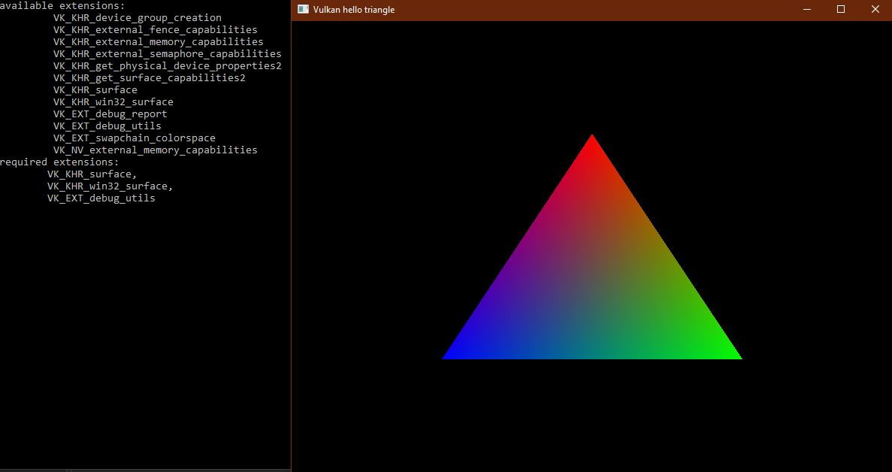

# Vulkan hello, world triangle
</img>

Basic steps required to bootstrap a vulkan application.  
Taken from https://vulkan-tutorial.com/  
  
Should be platform independent as using glfw and cmake build system  
Shader compilation done through cmake  
  

### Building on Windows 10 and Visual Studio 2019  

##### Install dependencies
Install cmake  
Install vcpkg (https://github.com/Microsoft/vcpkg)  
Install the vulkan SDK (https://vulkan.lunarg.com/sdk/home)  

```
vcpkg install glfw3:x64-windows  
vcpkg install vulkan:x64-windows  
```


##### Build
```
build.bat
```
